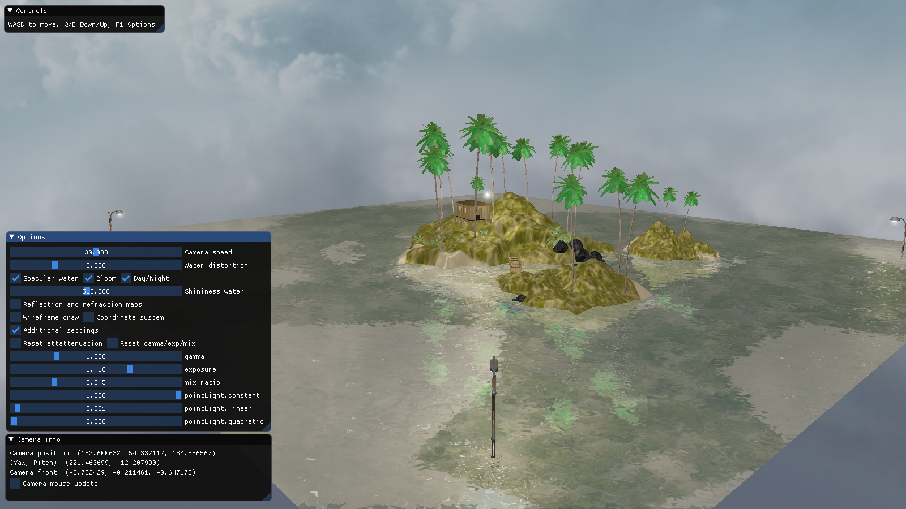

Mini island opengl demo (little project made for course computer graphics Faculty of mathematics Belgrade)  
preview: https://www.youtube.com/watch?v=r7Ph7fhLG7o  
  
The project include:  
-basic lighting (point lights, directional light)  
-face culling  
-Blinn-Phong lighting  
-framebuffers  
-instancing  
-skybox cubemap  
-discard blending  
-bloom (+ gamma correct, tone mapping)  
  
-free camera with zoom support  
-menu done with imGui  

